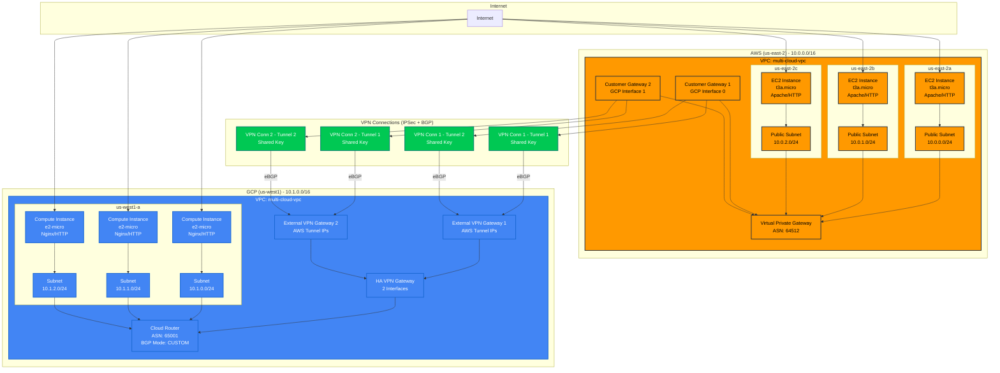

# Multi Cloud VPC Peering

## Objective

Multi cloud networking POC (Proof of Concept) between AWS and GCP using their VPN solutions and eBGP advertising. See the network diagram [here](./network-diagram.md).

## Security Notes

⚠️ **This is a POC with intentionally relaxed security for ease of testing:**

- SSH open to 0.0.0.0/0
- Shared VPN key in code
- `gcloud` CLI
- All instances have public IPs

## Prerequisites

- A valid and active AWS account
- A valid and active GCP account
- `terraform` (I use [tfenv](https://github.com/tfutils/tfenv) to manage my terraform versions)
- **(OPTIONAL)** [aws-vault](https://github.com/99designs/aws-vault)

## Network diagram



## How to run

1. Export your AWS variables (or use `aws-vault`). I only tested in `us-east-2`.

    ```bash
    AWS_ACCESS_KEY_ID=REDACTED
    AWS_SECRET_ACCESS_KEY=REDACTED
    AWS_REGION=us-east-2
    ```

1. Configure `gcloud` auth:

    ```bash
    gcloud init
    gcloud auth application-default login
    ```

1. Initialize the project:

    ```bash
    terraform init
    ```

1. Configure your variables (the only ones that are required are the SSH related variables) in `terraform.tfvars`

    ```hcl
    # terraform.tfvars example
    aws_ssh_keypair_name   = "ssh"
    aws_ssh_keypair_exists = true
    aws_region             = "us-east-2"
    ```

1. Spin up the infra:

    ```bash
    make all
    ```

1. SSH into one of the 6 instances provisioned and `curl` and `ping` the other instances through the private IP, it should be working!

## Terraform Docs

<!-- BEGIN_TF_DOCS -->
## Requirements

| Name | Version |
|------|---------|
| <a name="requirement_aws"></a> [aws](#requirement\_aws) | ~> 6.0 |
| <a name="requirement_google"></a> [google](#requirement\_google) | 7.7.0 |
| <a name="requirement_random"></a> [random](#requirement\_random) | 3.7.2 |

## Providers

| Name | Version |
|------|---------|
| <a name="provider_aws"></a> [aws](#provider\_aws) | 6.17.0 |
| <a name="provider_google"></a> [google](#provider\_google) | 7.7.0 |
| <a name="provider_random"></a> [random](#provider\_random) | 3.7.2 |

## Modules

| Name | Source | Version |
|------|--------|---------|
| <a name="module_aws_vpc"></a> [aws\_vpc](#module\_aws\_vpc) | terraform-aws-modules/vpc/aws | n/a |
| <a name="module_gcp_vpc"></a> [gcp\_vpc](#module\_gcp\_vpc) | terraform-google-modules/network/google | ~> 12.0 |

## Resources

| Name | Type |
|------|------|
| [aws_instance.this](https://registry.terraform.io/providers/hashicorp/aws/latest/docs/resources/instance) | resource |
| [aws_key_pair.this](https://registry.terraform.io/providers/hashicorp/aws/latest/docs/resources/key_pair) | resource |
| [aws_vpn_connection.this](https://registry.terraform.io/providers/hashicorp/aws/latest/docs/resources/vpn_connection) | resource |
| [google_compute_external_vpn_gateway.this](https://registry.terraform.io/providers/hashicorp/google/7.7.0/docs/resources/compute_external_vpn_gateway) | resource |
| [google_compute_ha_vpn_gateway.this](https://registry.terraform.io/providers/hashicorp/google/7.7.0/docs/resources/compute_ha_vpn_gateway) | resource |
| [google_compute_instance.this](https://registry.terraform.io/providers/hashicorp/google/7.7.0/docs/resources/compute_instance) | resource |
| [google_compute_router.this](https://registry.terraform.io/providers/hashicorp/google/7.7.0/docs/resources/compute_router) | resource |
| [google_compute_router_interface.this](https://registry.terraform.io/providers/hashicorp/google/7.7.0/docs/resources/compute_router_interface) | resource |
| [google_compute_router_peer.this](https://registry.terraform.io/providers/hashicorp/google/7.7.0/docs/resources/compute_router_peer) | resource |
| [google_compute_vpn_tunnel.this](https://registry.terraform.io/providers/hashicorp/google/7.7.0/docs/resources/compute_vpn_tunnel) | resource |
| [random_password.shared_key](https://registry.terraform.io/providers/hashicorp/random/3.7.2/docs/resources/password) | resource |
| [aws_key_pair.this](https://registry.terraform.io/providers/hashicorp/aws/latest/docs/data-sources/key_pair) | data source |

## Inputs

| Name | Description | Type | Default | Required |
|------|-------------|------|---------|:--------:|
| <a name="input_aws_ssh_keypair_name"></a> [aws\_ssh\_keypair\_name](#input\_aws\_ssh\_keypair\_name) | Name of the AWS SSH key pair. | `string` | n/a | yes |
| <a name="input_aws_ami"></a> [aws\_ami](#input\_aws\_ami) | AMI ID for the AWS EC2 instances. | `string` | `"ami-0199d4b5b8b4fde0e"` | no |
| <a name="input_aws_asn"></a> [aws\_asn](#input\_aws\_asn) | Amazon Side ASN for the AWS VPN Gateway. | `string` | `"64512"` | no |
| <a name="input_aws_instance_type"></a> [aws\_instance\_type](#input\_aws\_instance\_type) | Instance type for the AWS EC2 instances. | `string` | `"t3a.micro"` | no |
| <a name="input_aws_region"></a> [aws\_region](#input\_aws\_region) | AWS region. | `string` | `"us-east-2"` | no |
| <a name="input_aws_ssh_keypair_exists"></a> [aws\_ssh\_keypair\_exists](#input\_aws\_ssh\_keypair\_exists) | Set to true if the AWS SSH key pair already exists. | `bool` | `false` | no |
| <a name="input_aws_ssh_public_key_path"></a> [aws\_ssh\_public\_key\_path](#input\_aws\_ssh\_public\_key\_path) | Path to the AWS SSH public key. Used to login to EC2 instances. | `string` | `"~/.ssh/id_ed25519.pub"` | no |
| <a name="input_aws_vpc_cidr"></a> [aws\_vpc\_cidr](#input\_aws\_vpc\_cidr) | AWS VPC CIDR. | `string` | `"10.0.0.0/16"` | no |
| <a name="input_aws_vpc_name"></a> [aws\_vpc\_name](#input\_aws\_vpc\_name) | Name of the AWS VPC. | `string` | `"multi-cloud-vpc"` | no |
| <a name="input_gcp_asn"></a> [gcp\_asn](#input\_gcp\_asn) | GCP Side ASN for the GCP VPN Gateway. | `string` | `"65001"` | no |
| <a name="input_gcp_network_cidr"></a> [gcp\_network\_cidr](#input\_gcp\_network\_cidr) | GCP VPC CIDR. | `string` | `"10.1.0.0/16"` | no |
| <a name="input_gcp_network_name"></a> [gcp\_network\_name](#input\_gcp\_network\_name) | Name of the GCP VPC network. | `string` | `"multi-cloud-vpc"` | no |
| <a name="input_gcp_project_id"></a> [gcp\_project\_id](#input\_gcp\_project\_id) | GCP Project ID. | `string` | `"multi-region-network"` | no |
| <a name="input_gcp_region"></a> [gcp\_region](#input\_gcp\_region) | GCP region for the resources. | `string` | `"us-west1"` | no |

## Outputs

| Name | Description |
|------|-------------|
| <a name="output_aws_instances_address"></a> [aws\_instances\_address](#output\_aws\_instances\_address) | n/a |
| <a name="output_gcp_bgp_info"></a> [gcp\_bgp\_info](#output\_gcp\_bgp\_info) | GCP BGP configuration |
| <a name="output_gcp_instances_address"></a> [gcp\_instances\_address](#output\_gcp\_instances\_address) | n/a |
| <a name="output_vpn_tunnel_status"></a> [vpn\_tunnel\_status](#output\_vpn\_tunnel\_status) | VPN tunnel information for debugging |
<!-- END_TF_DOCS -->
