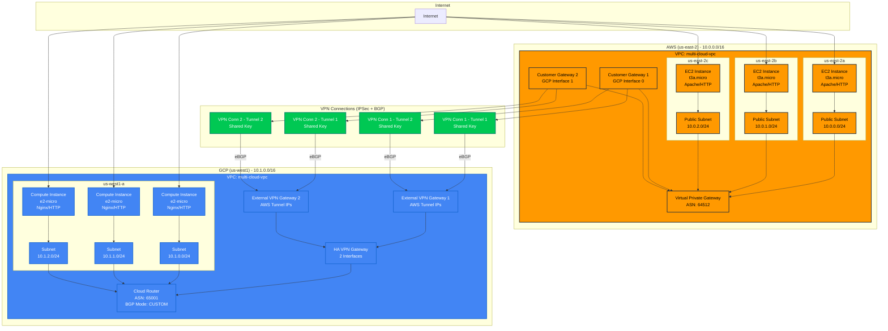

# Multi-Cloud Network Diagram

## Architecture Overview

## Network Details

### AWS Configuration

| Propriedade | Valor |
|-------------|-------|
| **Region** | us-east-2 |
| **VPC CIDR** | 10.0.0.0/16 |
| **VPC Name** | multi-cloud-vpc |
| **ASN** | 64512 |
| **VPN Gateway** | Virtual Private Gateway |
| **Customer Gateways** | 2 (one per GCP HA VPN interface) |

#### AWS Subnets

| Availability Zone | CIDR | Type | Instance Type | Web Server |
|-------------------|------|------|---------------|------------|
| us-east-2a | 10.0.0.0/24 | Public | t3a.micro | Apache |
| us-east-2b | 10.0.1.0/24 | Public | t3a.micro | Apache |
| us-east-2c | 10.0.2.0/24 | Public | t3a.micro | Apache |

### GCP Configuration

| Propriedade | Valor |
|-------------|-------|
| **Region** | us-west1 |
| **VPC CIDR** | 10.1.0.0/16 |
| **VPC Name** | multi-cloud-vpc |
| **ASN** | 65001 |
| **Routing Mode** | GLOBAL |
| **VPN Gateway** | HA VPN Gateway (2 interfaces) |
| **Cloud Router** | With BGP (CUSTOM mode) |

#### GCP Subnets

| Zone | CIDR | Type | Instance Type | Web Server |
|------|------|------|---------------|------------|
| us-west1-a | 10.1.0.0/24 | Public | e2-micro | Nginx |
| us-west1-a | 10.1.1.0/24 | Public | e2-micro | Nginx |
| us-west1-a | 10.1.2.0/24 | Public | e2-micro | Nginx |

### VPN Configuration

| Propriedade | Valor |
|-------------|-------|
| **Protocol** | IPSec |
| **Routing Protocol** | eBGP (External BGP) |
| **Total Tunnels** | 4 (2 per Customer Gateway) |
| **Authentication** | Pre-shared key |
| **AWS ASN** | 64512 |
| **GCP ASN** | 65001 |
| **Route Advertisement** | Dynamic via BGP |
| **Redundancy** | Active-Active (HA) |

#### VPN Tunnels

| Tunnel | AWS Side | GCP Side | BGP Session |
|--------|----------|----------|-------------|
| VPN Connection 1 - Tunnel 1 | Customer Gateway 1 | HA VPN Interface 0 | Active |
| VPN Connection 1 - Tunnel 2 | Customer Gateway 1 | HA VPN Interface 0 | Active |
| VPN Connection 2 - Tunnel 1 | Customer Gateway 2 | HA VPN Interface 1 | Active |
| VPN Connection 2 - Tunnel 2 | Customer Gateway 2 | HA VPN Interface 1 | Active |

### Security Groups / Firewall Rules

| Rule | Protocol | Port | Source | Direction | Both Clouds |
|------|----------|------|--------|-----------|-------------|
| SSH Access | TCP | 22 | 0.0.0.0/0 | Ingress | Yes |
| HTTP from AWS | TCP | 80 | 10.0.0.0/16 | Ingress | Yes |
| HTTP from GCP | TCP | 80 | 10.1.0.0/16 | Ingress | Yes |
| ICMP/Ping | ICMP | - | 0.0.0.0/0 | Ingress | Yes |
| All Egress | All | All | 0.0.0.0/0 | Egress | Yes |

## Traffic Flow

### Cross-Cloud Communication

| Source | Destination | Path | Protocol |
|--------|-------------|------|----------|
| AWS Instances (10.0.x.x) | GCP Instances (10.1.x.x) | VPN Tunnels | IPSec + BGP |
| GCP Instances (10.1.x.x) | AWS Instances (10.0.x.x) | VPN Tunnels | IPSec + BGP |
| Any Instance | Internet | Direct (public IPs) | HTTP/HTTPS/SSH |

### High Availability

| Feature | Implementation | Benefit |
|---------|----------------|---------|
| Multiple Tunnels | 4 VPN tunnels total | Automatic failover if one tunnel fails |
| Redundant Gateways | 2 Customer Gateways + 2 VPN interfaces | No single point of failure |
| Dynamic Routing | BGP route advertisement | Automatic route updates |
| Geographic Distribution | AWS: 3 AZs, GCP: 1 Zone | Resilience to zone failures (AWS) |
